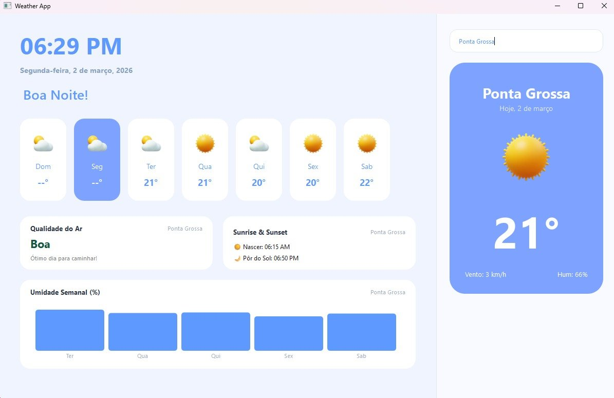

# 🌤️ Weather App

Aplicativo desktop de previsão do tempo desenvolvido em Python com PySide6 (Qt), consumindo dados em tempo real da [OpenWeatherMap API](https://openweathermap.org/).

---

## 📸 Preview



---

## ✨ Funcionalidades

- 🔍 Pesquisa de qualquer cidade do mundo
- 🌡️ Temperatura atual, vento e humidade
- 📅 Previsão para os próximos dias da semana
- 💨 Qualidade do ar com índice AQI
- 🌅 Horários de nascer e pôr do sol
- 📊 Gráfico de umidade semanal
- 🕐 Relógio e data em tempo real
- ⚡ Busca assíncrona com QThread (sem travar a interface)

---

## 🗂️ Estrutura do Projeto

```
weather-app/
├── main.py                          # Janela principal e lógica de interface
├── qt_core.py                       # Importações centralizadas do Qt
├── .env                             # Chave da API (não commitado)
├── .gitignore
│
├── gui/
│   ├── janelas/
│   │   └── tela_principal/
│   │       └── ui_tela_principal.py # Layout da interface
│   ├── widgets/
│   │   ├── py_card.py               # Card de clima por dia
│   │   └── grafico.py               # Gráfico de umidade
│   └── images/
│       └── icons/                   # Ícones do tempo
│
└── services/
    ├── weather_service.py           # Requisições à OpenWeather API
    └── weather_worker.py            # QThread para busca assíncrona
```

---

## 🚀 Como rodar o projeto

### 1. Clone o repositório

```bash
git clone https://github.com/seu-usuario/weather-app.git
cd weather-app
```

### 2. Crie e ative um ambiente virtual (recomendado)

```bash
python -m venv venv

# Windows
venv\Scripts\activate

# Linux/Mac
source venv/bin/activate
```

### 3. Instale as dependências

```bash
pip install -r requirements.txt
```

### 4. Configure a chave da API

Crie um arquivo `.env` na raiz do projeto:

```
OPENWEATHER_KEY=sua_chave_aqui
```

> Obtenha sua chave gratuita em: [openweathermap.org](https://home.openweathermap.org/users/sign_up)

### 5. Execute o app

```bash
python main.py
```

---

## 📦 Dependências

```
PySide6
requests
python-dotenv
```

> Gere o `requirements.txt` com: `pip freeze > requirements.txt`

---

## 🌐 API utilizada

- [OpenWeatherMap](https://openweathermap.org/) — plano gratuito
  - `/weather` — clima atual
  - `/forecast` — previsão 5 dias
  - `/air_pollution` — qualidade do ar

---

## 🎨 Créditos dos Ícones

Os ícones utilizados neste projeto são fornecidos por [Icons8](https://icons8.com):

| Ícone | Crédito |
|-------|---------|
| Parcialmente Nublado | <a target="_blank" href="https://icons8.com/icon/TquwKm18epOW/partly-cloudy-day">Partly Cloudy Day</a> icon by <a target="_blank" href="https://icons8.com">Icons8</a> |
| Neve | <a target="_blank" href="https://icons8.com/icon/mn6t2pvcYFMM/snow">Snow</a> icon by <a target="_blank" href="https://icons8.com">Icons8</a> |
| Chuva | <a target="_blank" href="https://icons8.com/icon/t2VSFJAf1MHP/umbrella">Umbrella</a> icon by <a target="_blank" href="https://icons8.com">Icons8</a> |
| Sol | <a target="_blank" href="https://icons8.com/icon/iFk18swetEyt/sun">Sun</a> icon by <a target="_blank" href="https://icons8.com">Icons8</a> |
| Tempestade | <a target="_blank" href="https://icons8.com/icon/SpZSUswN9tJs/storm">Storm</a> icon by <a target="_blank" href="https://icons8.com">Icons8</a> |

---

## 📄 Licença

Este projeto está sob a licença MIT. Veja o arquivo [LICENSE](LICENSE) para mais detalhes.
